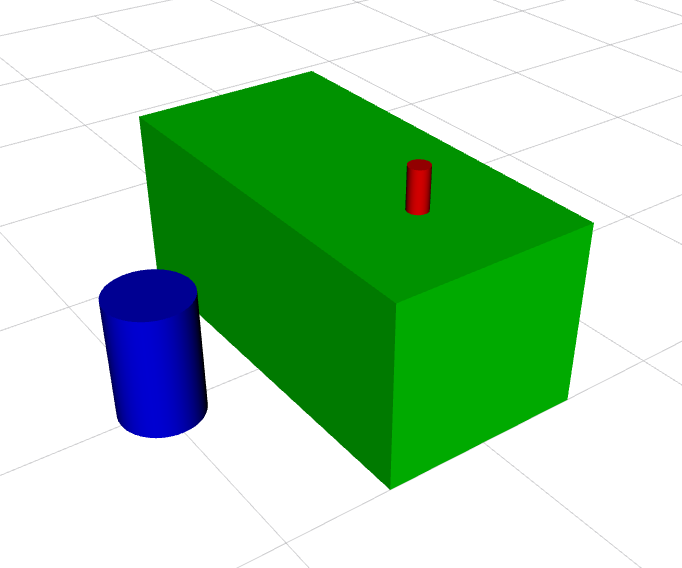
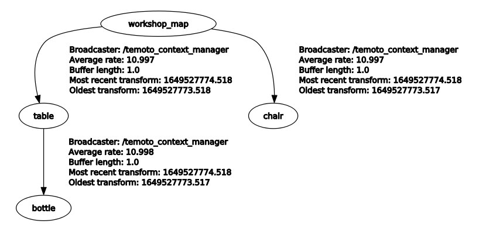

# temoto_context_manager
TeMoto Context Manager hosts an Environment Model Repository (ERM), which is used to store relations with
world objects. The ERM is shared and synchronized with multiple instances of Context Manager, thus enabling
the robots to share knowledge about the surrounding environment.

## Installation

``` bash
cd catkin_ws/src
git clone https://github.com/temoto-framework/temoto_context_manager
cd ..
catkin build
```

## Examples
First launch the visualization setup that brings up:
* **Context Manager**, which hosts the ERM
* **ERM marker publisher**, which publishes `visualization_msgs::Marker` messages
* **RViz**, which displays the visualization markers

``` bash
roslaunch temoto_context_manager emr_item_visualizer.launch
```

Next, add some items (table, chair, bottle) to the EMR via:
``` bash
rosrun temoto_context_manager emr_item_setter_example
```

You should see this rather modest scene in RViz:
<p align="center">
  
</p>

And also the contents of EMR are available via TFs:
<p align="center">
  
</p>